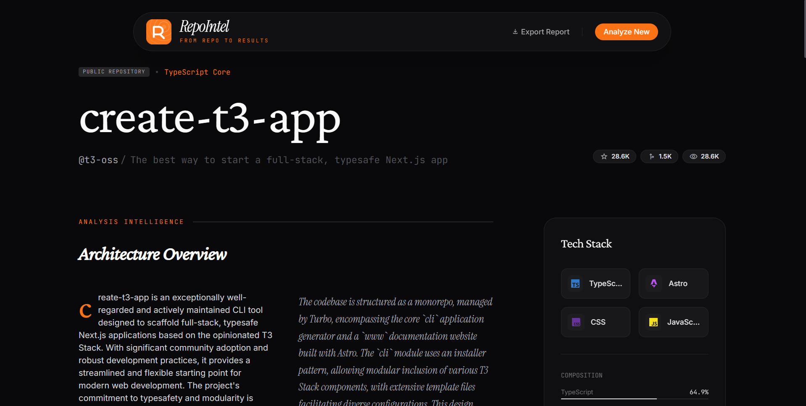
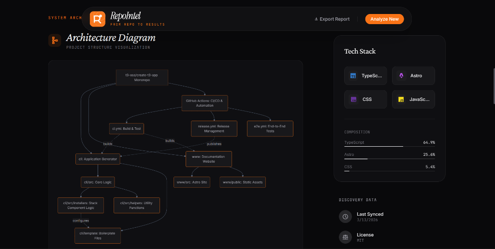
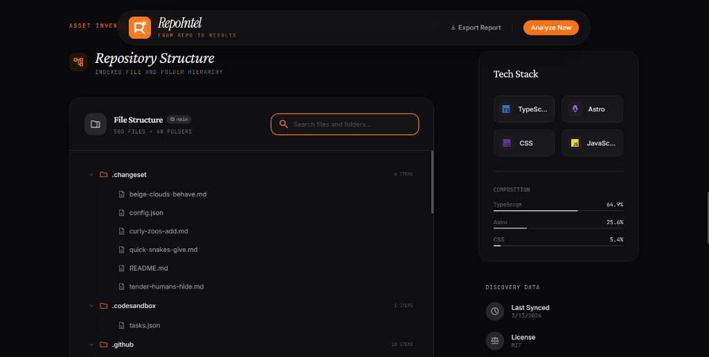
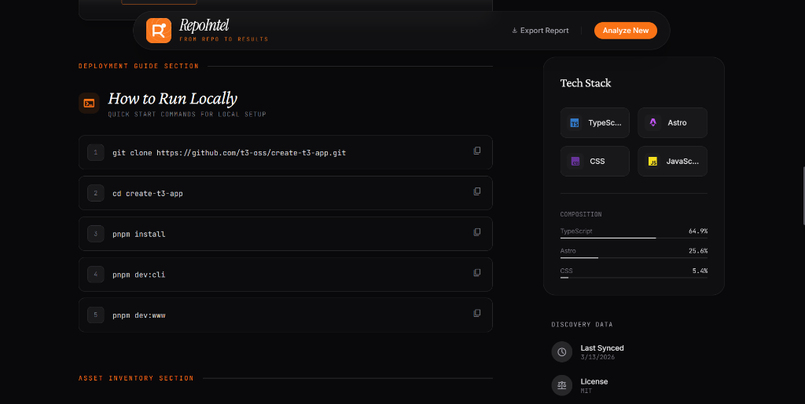
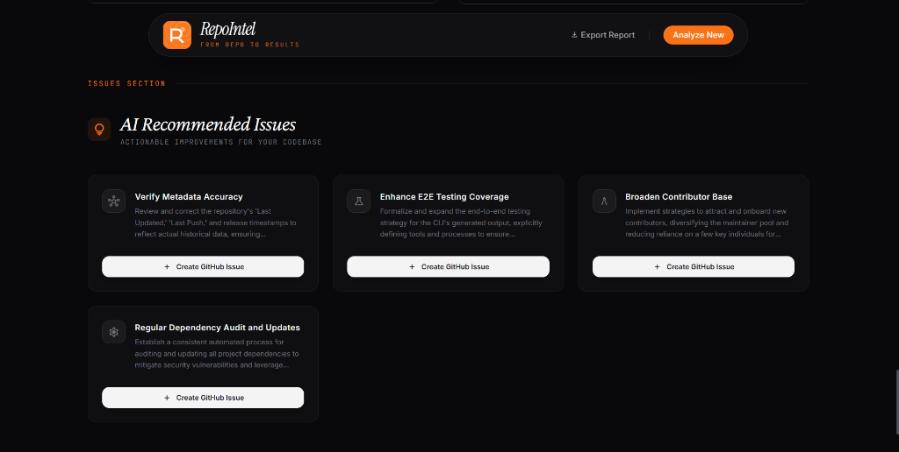

<div align="center">
  
  <h1>RepoIntel</h1>
  <p><em>AI-Powered GitHub Repository Intelligence</em></p>
</div>

---

## 🚀 About RepoIntel
RepoIntel is an intelligent, automated technical auditing tool designed to transform static GitHub repositories into dynamic, actionable intelligence reports. Under the hood, it seamlessly coordinates with the GitHub REST API to index repository structures—fetching critical component files, configuration details, and full dependency traces. By synthesizing this data through the **Google Gemini AI 2.5 Flash**, RepoIntel generates comprehensive architectural analyses, heuristic quality scores, risk discovery, and concrete improvement recommendations.



## ✨ Features
- **One-Click Analysis**: Turn any public GitHub URL into a fully-fledged tech report within seconds.
- **AI-Powered Diagnostics**: A technical exploration of the codebase structure and engineering philosophy, guided by Google's Gemini LLMs.
- **Architectural Diagramming**: Auto-generates **Mermaid.js** flowcharts mapping the core architecture.
- **Advanced Scoring Mechanism**: Evaluates the project robustly on *Quality*, *Security*, *Documentation*, and *Maintainability* (on a 0-100 scale).
- **Executable Run Instructions**: Analyzes dependency files (e.g., `package.json`, `requirements.txt`, `go.mod`) to predict and formulate accurate local setup commands.
- **Tech Stack Profiling**: Detects primary and secondary frameworks, as well as CI/CD infrastructure, containerization contexts, and testing suites.
- **Risk Identification & Recommendations**: Flags issues such as lacking automated testing mechanisms or security vulnerabilities, and generates technical debt/refactoring recommendations.
- **Sleek, Responsive Workflow**: Complete with smooth micro-animations and a premium, modern dark-mode aesthetic.

## 📸 Showcase

### Architecture Visualization
*Auto-generated flowchart mappings constructed from the codebase core entry files and dependencies.*


### Explored Repository Structure
*Frictionless navigation and insight into complex structures directly from the index layout.*


### Automated Setup Instructions
*Intelligently synthesized quick-start local installation commands tailored per language and framework.*


### Actionable AI Diagnostics
*Smart issue recommendations highlighting security, documentation, and technical debt priorities.*


## ⚙️ How It Works
1. **Intake**: You submit a GitHub repo URL via the frontend UI.
2. **Scraping & Extraction**: The Express.js backend parses the repository URL and interacts with the GitHub API in parallel to extract metadata, language distribution, file tree hierarchies, configuration artifacts, and dependencies.
3. **AI Evaluation**: A curated text prompt, paired with the repository's precise file layout and text contents, is transmitted to the Gemini API for semantic understanding.
4. **Synthesis & Visualization**: Gemini returns a strictly typed JSON schema capturing architectural components, a Mermaid architectural diagram string, observations, and diagnostics.
5. **Interactive Display**: The Vite frontend handles the payload effortlessly, animating results into beautiful dashboard charts and cards. 

## 📁 Project Structure

```text
.
├── public/
├── server/
├── src/
│   ├── components/
│   ├── pages/
│   ├── styles/
│   └── utils/
├── .env
├── .gitattributes
├── .gitignore
├── index.html
├── package-lock.json
└── package.json
```

The [`server/`](./server/) directory holds the Express backend. It handles fetching data from external APIs and provides an abstraction layer for the analysis logic. Within the [`src/`](./src/) directory, [`src/pages/`](./src/pages/) handles the modular rendering logic for each individual view in the single-page application. The [`src/components/`](./src/components/) directory isolates reusable UI elements, such as the interactive diagrams. The [`public/`](./public/) directory stores static assets, including the application logo.

## 🛠️ How to Use (Local Setup)

1. **Clone the Repository**
   ```bash
   git clone https://github.com/Yuval-Varke/RepoIntel.git
   cd RepoIntel
   ```

2. **Environment Configuration**
   Create a `.env` file in the root directory based on `.env.example`. Add the following API keys:
   ```env
   # Obtain a Personal Access Token from GitHub to bypass heavy unauthenticated rate limits.
   GITHUB_TOKEN=your_github_personal_access_token
   # Obtain a Gemini API Key to enable AI analysis.
   GEMINI_API_KEY=your_google_gemini_api_key
   # Backend API port
   PORT=3001
   ```
   > **Note**: While the `GITHUB_TOKEN` is optional, unauthenticated API usage is severely gated. A `GEMINI_API_KEY` is fully required for deep-level analytical insight; absent an API key, RepoIntel will fall back to using static heuristic checks.

3. **Install Dependencies**
   ```bash
   npm install
   ```

4. **Launch Application for Development**
   ```bash
   npm run dev
   ```
   Using `concurrently`, RepoIntel spins up both the Node API environment on Port `3001` and the Web UI environment on Vite's default port (`5173`).

   *Alternatively, to build and run the consolidated production build:*
   ```bash
   npm run build && npm start
   ```

5. **Open Application**
   Navigate to `http://localhost:5173` (if using `npm run dev`) or `http://localhost:3001` (if running the production build) in your web browser, enter a repository like `facebook/react`, and access actionable insights!
